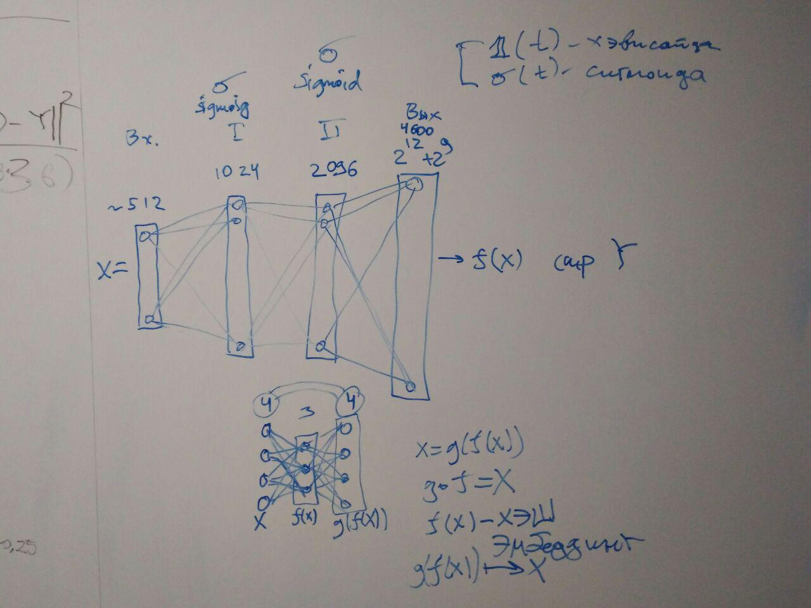

# drum_and_bass
Карпенко, Крыштапович, НИР 2019

### Задачи:
1. Разобраться с PyTorch
2. Создать ffnn сеть 32*14->64*36, преобразующую барабанную партию в бас-партию
 * Сделать полносвязную нейронную сеть
 
 * Сделать свёрточную нейросеть и сравнить их результаты
 
Не нужно пока что делать много нейронов в сетке :)

**Задача 2 -- seq2seq**
Ключевые слова от Вани:
1. reconstruction loss
2. BLEU -- Believel Evaluation Understanding
3. Perplexity, Entropy

* Final product -- paper: in English!
* Comparison of the `pix2pix` and `seq2seq`

**Конференция 10.01.2020**

Conditioning -- это добавление сети метаинформации посредством конкатенации к одномерному вектору.
Неплохо было бы попробовать использоваеть conditioning на
1. FCNN с автоэнкодером
2. LSTM

### LSTM -> FCNN
В качестве энкодера -- LSTM, в качестве декодера -- FCNN.
В качестве коднишнинга добавляется темп и инструмент (оба оригинальными числами).
Кондишнинг добавляется сразу после выхода из LSTM, который генерирует по изображению 64x14, где 14 -- число инструментов, а 64 -- число временных отсечек, вектор размера 64.

Далее, оба параметра добавляются к вектору, получая вектор размера 1x66, который отправляется в декодер.
Декодер спредставляет из себя FCNN из пяти слоёв, в третьем снова подмешивается информация о кондишнинге.

####Наблюдения:
1. Нейронная сеть выдаёт по одной барабанной партии одну басовую партию. Следовательно, страдает разнообразие генерируемой музыки
2. (следствие из 1) В датасете (скорее всего) имеются типичные ритмы, которым соответствуют абсолютно разные мелодии на разных инструментах. Это сильно сбивает с толку нейросеть. Как следствие, на уникальных ритмах нейросеть переобучается, а на типичных -- не понимает, какую мелодию сгенерировать

####Предложения:
1. Придумать способ разделить пары (каким-то образом) в данной ситуации, возможно добавить жанр или ещё что..
2. Разметить музыку тональностями -- это может упростить обучение нейросети
3. Добавить случайность в латентное пространство